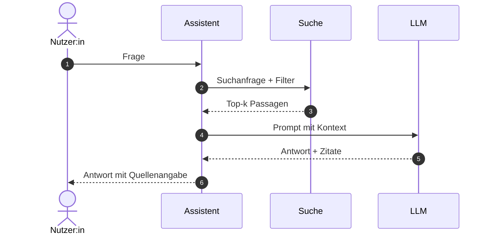
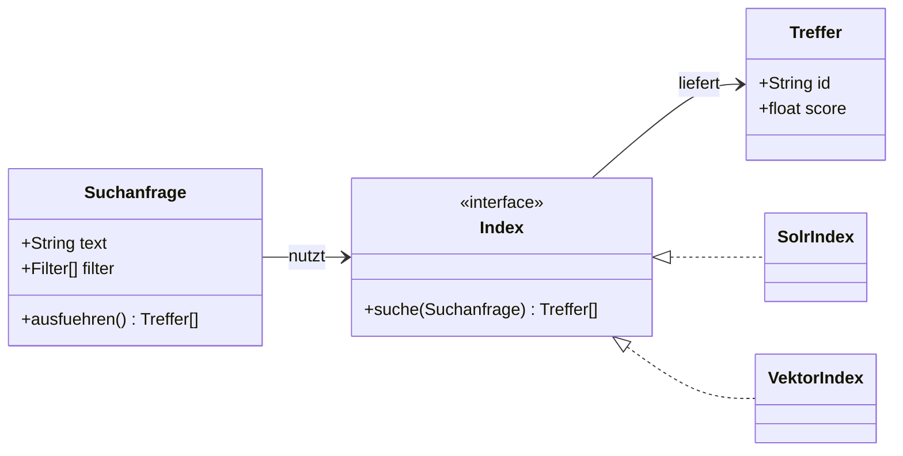

---
# ─── Deck-Konfiguration ───────────────────────────────────────────────
# Für ein neues Deck: Titel, Speaker, Event und themeConfig anpassen.
theme: default
title: SHI Slides Template
titleTemplate: '%s · SHI GmbH'
author: SHI GmbH
favicon: /favicon.png
lang: de # sonst steht <html lang="en"> im Deck und im PDF

# CI-Schriften (wie shi-gmbh.com: Open Sans 400/600/700).
# provider: none – die Fonts liegen als Paket im Repo und werden in
# styles/index.ts geladen. Nichts wird zur Laufzeit von Google geholt.
fonts:
  sans: Open Sans
  serif: Open Sans
  mono: JetBrains Mono
  provider: none

# 'auto' = umschaltbar (Taste "d" bzw. Button in der Navigationsleiste), Start
# nach Systemeinstellung. 'light' oder 'dark' nageln das Deck fest – nur dann
# ist der Umschalter bewusst deaktiviert.
colorSchema: auto
aspectRatio: 16/9
canvasWidth: 980
lineNumbers: false
transition: slide-left
drawings:
  persist: false
# download: true würde bei JEDEM `slidev build` einen PDF-Export mit Chromium
# anstoßen – auch im Deploy auf Netlify/Vercel, wo kein Browser installiert ist.
# Wer den Download-Button will: PDF per `npm run export` bauen, nach public/
# legen und hier `download: /shi-slides.pdf` eintragen.
download: false
exportFilename: shi-slides
comark: true # erlaubt `[Text]{style="color:red"}` und `{width=500px}`

# Vorschaubild/Beschreibung beim Teilen des gehosteten Decks (netlify.toml / vercel.json).
# Ohne ogImage bleibt die Vorschau eine reine Textkarte. Bild nach public/ legen
# und beide Zeilen mit der echten Deploy-URL einkommentieren.
# (`ogImage: auto` gäbe es auch, würde aber beim Build wieder Chromium starten.)
seoMeta:
  ogTitle: SHI Slides Template
  ogDescription: Basis-Template für Präsentationen der SHI GmbH
  twitterCard: summary_large_image
  # ogUrl: https://deck.example.com/
  # ogImage: https://deck.example.com/og.png

# Fußzeile auf allen Inhaltsfolien (slide-bottom.vue)
themeConfig:
  footer: SHI Slides Template
  event: Interner Tech Talk · 2026
  # confidential: Intern – vertraulich   # nur für interne Decks setzen

info: |
  ## SHI Slides Template
  Basis-Template für Konferenz-, Kunden- und interne Präsentationen der SHI GmbH.

layout: cover
subtitle: Ein Baukasten für Konferenz-, Kunden- und interne Vorträge im SHI-Design
speaker: Vorname Nachname
role: Rolle · SHI GmbH
event: Interner Tech Talk
date: 2026
---

# SHI Slides Template

<!--
Presenter-Notes stehen in HTML-Kommentaren und sind nur im Presenter-Modus (Taste "P") sichtbar.
-->

---
layout: agenda
note: Halte die Agenda auf 4–6 Punkte. Vor jedem Kapitel mit `current:` wiederholen.
items:
  - label: Layouts
    hint: Intro, Agenda, Kapitel, Outro
  - label: Inhaltsfolien
    hint: Text, Grafik, Code
  - label: Komponenten
    hint: Karten, Kennzahlen, Callouts
  - label: Diagramme & Icons
    hint: Abläufe, Architektur, KI-Themen
  - label: Eigenes Deck bauen
    hint: 5 min
---

---
layout: section
number: 1
subtitle: Alles, was ein Vortrag an Gerüst braucht – ohne Design-Entscheidungen pro Folie.
---

# Layouts

---
layout: agenda
current: 1
items:
  - Layouts
  - Inhaltsfolien
  - Komponenten
  - Diagramme & Icons
  - Eigenes Deck bauen
---

---

# Layout-Übersicht

Eigene SHI-Layouts – der Rest kommt aus Slidev.

<div class="grid grid-cols-2 gap-x-10 mt-6 text-sm">

| Eigenes Layout | Wofür                               |
| -------------- | ----------------------------------- |
| `cover`        | Titelfolie mit Speaker & Event      |
| `agenda`       | Agenda, wiederholbar mit `current:` |
| `section`      | Kapiteltrenner mit Nummer           |
| `speaker`      | Vorstellung der sprechenden Person  |
| `statement`    | Die eine Aussage, die bleibt        |
| `quote`        | Kundenzitat / Testimonial           |
| `outro`        | Abschluss, Kontakt, QR-Code         |

<div>

**Dazu alle Slidev-Built-ins**, auf die SHI-CI gestylt:

<div class="flex flex-wrap gap-2 mt-3">
  <Tag color="neutral">default</Tag>
  <Tag color="neutral">center</Tag>
  <Tag color="neutral">two-cols</Tag>
  <Tag color="neutral">two-cols-header</Tag>
  <Tag color="neutral">image-left</Tag>
  <Tag color="neutral">image-right</Tag>
  <Tag color="neutral">iframe-right</Tag>
  <Tag color="neutral">full</Tag>
  <Tag color="neutral">fact</Tag>
</div>

<Callout type="tip" class="mt-6">
Layouts liegen in <code>layouts/</code>, Komponenten in <code>components/</code> – beides
lässt sich pro Deck erweitern, ohne das Template zu forken.
</Callout>

</div>

</div>

---
layout: speaker
name: Vorname Nachname
role: Rolle · SHI GmbH
image: /speaker-placeholder.svg
mail: vorname.nachname@shi-gmbh.com
linkedin: profil-slug
github: username
---

- Was du machst, in einer Zeile
- Ein Fachthema, das zum Vortrag passt
- Ein Detail, an das sich Leute erinnern

<div class="mt-4 flex gap-2">
  <Tag>Suche</Tag>
  <Tag color="teal">TypeScript</Tag>
  <Tag color="violet">RAG</Tag>
</div>

---
layout: statement
source: Setze hier die Quelle – oder lass das Feld weg.
---

Eine Folie. Ein Gedanke.

---
layout: section
number: 2
subtitle: Text, Grafik, Code – die drei Fälle, die 90 % eines Vortrags ausmachen.
---

# Inhaltsfolien

---
layout: agenda
current: 2
items:
  - Layouts
  - Inhaltsfolien
  - Komponenten
  - Diagramme & Icons
  - Eigenes Deck bauen
---

---

# Standardfolie

Fließtext bleibt kurz. Die Aufzählung trägt, die Stimme erklärt.

- Erster Punkt, eine Zeile
- Zweiter Punkt mit **Betonung**
- Dritter Punkt mit [Link](https://shi-gmbh.com)

<v-clicks>

- Punkte per `<v-clicks>` nacheinander einblenden
- Klick für Klick, ohne Frontmatter-Aufwand

</v-clicks>

---
layout: two-cols-header
---

# Zwei Spalten

Für Gegenüberstellungen: vorher/nachher, Problem/Lösung, Option A/B.

::left::

### Vorher

- Volltextsuche über alles
- Ranking nach TF-IDF
- Keine Facetten

::right::

### Nachher

- Semantische Suche + Filter
- Gelerntes Ranking
- Facetten aus Metadaten

---
layout: image-right
image: /image-placeholder.svg
---

# Text neben Grafik

`image-left` und `image-right` füllen die halbe Folie randlos mit einem Bild.

- Screenshot, Diagramm oder Foto
- Text bleibt links lesbar
- Kein Beschnitt-Gefummel

<Callout type="info" class="mt-4">
Bilder gehören nach <code>public/</code> und werden mit absolutem Pfad referenziert:
<code>/architektur.png</code>.
</Callout>

---

# Diagramm

Die Standardform: `<Flow>` zeichnet eine Kette in CI-Farben – ohne Mermaid,
ohne Bilddatei. Details und die Mermaid-Fälle in Kapitel 4.

<Flow class="mt-10" :items="[
  { label: 'Quellsysteme', icon: 'i-carbon-data-base' },
  { label: 'Apache NiFi', icon: 'i-carbon-flow-data', hint: 'Aufbereitung' },
  { label: 'Solr / OpenSearch', icon: 'i-carbon-search', hint: 'Index' },
  { label: 'InfoPilot', icon: 'i-carbon-application' },
  { label: 'Nutzer:innen', icon: 'i-carbon-user' },
]" />

---

# Code

```ts {3-6|8-10}
import { Client } from '@opensearch-project/opensearch'

const client = new Client({
  node: process.env.OPENSEARCH_URL,
  ssl: { rejectUnauthorized: true },
})

const result = await client.search({
  index: 'werke',
  body: { query: { multi_match: { query: 'Arbeitsrecht', fields: ['titel^3', 'text'] } } },
})
```

<Callout type="tip" title="Zeilen schrittweise hervorheben" class="mt-4">
Der Marker <code>3-6|8-10</code> blendet die Blöcke nacheinander ein – ideal, um Code zu
erzählen statt vorzulesen. <code>all</code> als erster Schritt zeigt zunächst alles,
sieht im PDF-Export ohne <code>--with-clicks</code> aber ausgegraut aus.
</Callout>

---

# Code aus Datei

Externer Code bleibt lauffähig und lintbar – nie wieder Copy-Paste-Drift.

<<< @/snippets/external.ts#snippet ts {*}{lines:true}

---
layout: quote
author: Dr. Maxine Muster
position: Leiterin Digitale Produkte, Beispiel-Verlag
---

Die Trefferqualität ist bei uns heute ein Verkaufsargument, kein Ticket im Backlog.

---
layout: section
number: 3
subtitle: Bausteine, die in jedem Deck wieder auftauchen.
---

# Komponenten

---
layout: agenda
current: 3
items:
  - Layouts
  - Inhaltsfolien
  - Komponenten
  - Diagramme & Icons
  - Eigenes Deck bauen
---

---

# Karten

<CardGrid :cols="3" class="mt-8">
  <Card title="Suche" icon="i-carbon-search" variant="accent">
    Solr, Elasticsearch und OpenSearch – von der Analyse bis zum Relevanz-Tuning.
  </Card>
  <Card title="Daten" icon="i-carbon-data-base" variant="accent">
    Apache NiFi, Cribl und Cloudera für belastbare Datenstrecken.
  </Card>
  <Card title="KI" icon="i-carbon-machine-learning-model" variant="accent">
    RAG-Systeme und Assistenten auf dem eigenen Bestand.
  </Card>
</CardGrid>

---

# Kennzahlen & Hinweise

<div class="grid grid-cols-3 gap-6 mt-6">
  <Stat value="3×" label="schnellere Suche" hint="Median über alle Anfragen" />
  <Stat value="92 %" label="Trefferquote" hint="Top-5, gemessen an 1.200 Fragen" />
  <Stat value="6 Wo." label="bis zum Piloten" hint="Kickoff bis erste Indexstrecke" />
</div>

<div class="grid grid-cols-2 gap-3 mt-8">
  <Callout type="info" title="Info">Kontext, der nicht in die Aufzählung passt.</Callout>
  <Callout type="tip" title="Tipp">Der Kniff, den man sonst erst nach zwei Tagen findet.</Callout>
  <Callout type="warn" title="Achtung">Stolperstein, den das Publikum kennen sollte.</Callout>
  <Callout type="danger" title="Kein Weg">Anti-Pattern, klar als solches markiert.</Callout>
</div>

---

# Ablauf & Zeitstrahl

<div class="grid grid-cols-2 gap-10 mt-6">

<Steps :items="[
  { title: 'Verstehen', body: 'Daten, Nutzerfragen, Zielbild.' },
  { title: 'Prototyp', body: 'Trefferqualität an echten Daten messen.' },
  { title: 'Bauen', body: 'Suchstrecke und Portal produktionsreif.' },
]" />

<Timeline :items="[
  { when: 'Q1', title: 'Discovery', body: 'Datensichtung und Zielmetriken.' },
  { when: 'Q2', title: 'Pilot', body: 'Erste Indexstrecke live.' },
  { when: 'Q3', title: 'Rollout', tone: 'muted' },
]" />

</div>

---

# Logos

Kunden- oder Tech-Logos, standardmäßig entsättigt.

<LogoWall
  class="mt-10"
  height="52px"
  :logos="[
    { src: '/logo-placeholder.svg', alt: 'Kunde A' },
    { src: '/logo-placeholder.svg', alt: 'Kunde B' },
    { src: '/logo-placeholder.svg', alt: 'Kunde C' },
  ]"
/>

<Callout type="info" class="mt-10">
Fremdlogos nur mit Freigabe zeigen. <code>original</code> schaltet auf die Originalfarben um.
</Callout>

---
src: ./pages/shi-company.md
---

---
layout: section
number: 4
subtitle: Abläufe, Architekturen und KI-Themen – ohne dass es nach Wiki aussieht.
---

# Diagramme & Icons

---
layout: agenda
current: 4
items:
  - Layouts
  - Inhaltsfolien
  - Komponenten
  - Diagramme & Icons
  - Eigenes Deck bauen
---

---

# Pipeline

<Flow class="mt-8" clicks :items="[
  { label: 'Frage', icon: 'i-carbon-chat' },
  { label: 'Embedding', icon: 'i-carbon-model-alt', hint: 'Vektor' },
  { label: 'Retrieval', icon: 'i-carbon-search', hint: 'Top-k aus Solr' },
  { label: 'Kontext', icon: 'i-carbon-document', hint: 'Passagen + Quellen' },
  { label: 'LLM', icon: 'i-carbon-machine-learning-model', tone: 'brand' },
  { label: 'Antwort', icon: 'i-carbon-checkmark-outline', hint: 'mit Belegen' },
]" />

<Callout type="tip" title="Schritt für Schritt erzählen" class="mt-12">
Das Attribut <code>clicks</code> blendet die Knoten einzeln ein. Für den PDF-Export mit
allen Zwischenschritten <code>npm run export -- --with-clicks</code> nutzen.
</Callout>

---

# Kreislauf

<div class="grid grid-cols-[1.35fr_1fr] gap-10 mt-6 items-center">

<Flow
  loop="Beobachtung fließt in den nächsten Zug"
  :items="[
    { label: 'Ziel', icon: 'i-carbon-idea' },
    { label: 'Plan', icon: 'i-carbon-decision-tree' },
    { label: 'Werkzeug', icon: 'i-carbon-api', tone: 'brand' },
    { label: 'Prüfung', icon: 'i-carbon-rule' },
  ]"
/>

<div>

`loop` zeichnet die Rückführung – der Standardfall für Agenten, Feedback-Schleifen
und iterative Prozesse.

<Callout type="warn" title="Abbruch mit erzählen" class="mt-4">
Zu jeder Schleife gehört die Bedingung, die sie beendet: Zugbudget, Kosten, Konfidenz.
</Callout>

</div>

</div>

---

# Architektur in Schichten

<Layers class="mt-6" :items="[
  { title: 'Erlebnis', hint: 'was Nutzende sehen', items: [
    { label: 'Chat-Assistent', icon: 'i-carbon-chat-bot' },
    { label: 'Suchportal', icon: 'i-carbon-search' },
    { label: 'API', icon: 'i-carbon-api' },
  ] },
  { title: 'Orchestrierung', tone: 'brand', items: [
    { label: 'Prompt & Tools', icon: 'i-carbon-prompt-template' },
    { label: 'Guardrails', icon: 'i-carbon-security' },
    { label: 'Tracing', icon: 'i-carbon-ai-governance-lifecycle' },
  ] },
  { title: 'Modelle', items: [
    { label: 'LLM', icon: 'i-carbon-machine-learning-model' },
    { label: 'Embeddings', icon: 'i-carbon-model-alt' },
    { label: 'Reranker', icon: 'i-carbon-summary-kpi' },
  ] },
  { title: 'Wissen', hint: 'euer Bestand', items: [
    { label: 'Solr / OpenSearch', icon: 'i-carbon-search' },
    { label: 'Vektorindex', icon: 'i-carbon-chart-network' },
    { label: 'Quellsysteme', icon: 'i-carbon-data-base' },
  ] },
  { title: 'Betrieb', tone: 'muted', items: ['Kosten', 'Auswertung', 'Datenschutz'] },
]" />

---

# Mermaid für Sequenzen

Zeitliche Abläufe zwischen Beteiligten – hier ist Mermaid schneller als jede Komponente.

<div class="flex justify-center mt-2">



</div>

---

# Mermaid für Strukturen

Klassen, Zustände, Entitäten – dieselbe Palette, dieselbe Schrift.
`direction LR` nutzt das Querformat der Folie.

<div class="flex justify-center mt-2">



</div>

---

# Welches Werkzeug wofür

<div class="text-sm mt-4">

| Fall                                 | Werkzeug                   | Lizenz               |
| ------------------------------------ | -------------------------- | -------------------- |
| Ablauf, Pipeline, Schleife           | `<Flow>`                   | im Template          |
| Architektur, Stack                   | `<Layers>`                 | im Template          |
| Vergleich, Bausteine                 | `<CardGrid>` / `<Steps>`   | im Template          |
| Sequenz, Klassen, Zustand, ER        | Mermaid (eingebaut)        | MIT                  |
| Freie Skizze, Whiteboard-Optik       | Excalidraw → SVG           | MIT                  |
| Screenshot, Fremdgrafik              | Bild in `public/`          | Rechte prüfen        |

</div>

<Callout type="warn" title="Kein PlantUML" class="mt-6">
Slidev kennt <code>plantuml</code>-Blöcke, lädt sie aber bei jedem Rendern von
<code>plantuml.com</code> – der Diagrammtext verlässt damit das Haus. UML geht in Mermaid:
<code>classDiagram</code>, <code>stateDiagram-v2</code>, <code>erDiagram</code>.
</Callout>

---

# Icons

Alle Icons kommen als CSS-Klasse, ohne Datei im Repo: `<div class="i-carbon-ai" />`.

<div class="grid grid-cols-6 gap-y-6 gap-x-4 mt-8 text-center text-xs">
  <div><div class="i-carbon-ai text-3xl mx-auto text-[var(--shi-brand)]" /><div class="mt-1 font-mono">ai</div></div>
  <div><div class="i-carbon-machine-learning-model text-3xl mx-auto text-[var(--shi-brand)]" /><div class="mt-1 font-mono">machine-learning-model</div></div>
  <div><div class="i-carbon-model-alt text-3xl mx-auto text-[var(--shi-brand)]" /><div class="mt-1 font-mono">model-alt</div></div>
  <div><div class="i-carbon-prompt-template text-3xl mx-auto text-[var(--shi-brand)]" /><div class="mt-1 font-mono">prompt-template</div></div>
  <div><div class="i-carbon-chat-bot text-3xl mx-auto text-[var(--shi-brand)]" /><div class="mt-1 font-mono">chat-bot</div></div>
  <div><div class="i-carbon-decision-tree text-3xl mx-auto text-[var(--shi-brand)]" /><div class="mt-1 font-mono">decision-tree</div></div>
  <div><div class="i-carbon-ai-governance-lifecycle text-3xl mx-auto text-[var(--shi-brand)]" /><div class="mt-1 font-mono">ai-governance-lifecycle</div></div>
  <div><div class="i-carbon-text-mining text-3xl mx-auto text-[var(--shi-brand)]" /><div class="mt-1 font-mono">text-mining</div></div>
  <div><div class="i-carbon-data-vis-1 text-3xl mx-auto text-[var(--shi-brand)]" /><div class="mt-1 font-mono">data-vis-1</div></div>
  <div><div class="i-carbon-flow-data text-3xl mx-auto text-[var(--shi-brand)]" /><div class="mt-1 font-mono">flow-data</div></div>
  <div><div class="i-carbon-security text-3xl mx-auto text-[var(--shi-brand)]" /><div class="mt-1 font-mono">security</div></div>
  <div><div class="i-carbon-ai-launch text-3xl mx-auto text-[var(--shi-brand)]" /><div class="mt-1 font-mono">ai-launch</div></div>
</div>

<Callout type="info" class="mt-8">
Auswahl unter <a href="https://icones.js.org/collection/carbon">icones.js.org/collection/carbon</a>.
Carbon steht unter Apache 2.0 – kommerziell nutzbar, Namensnennung nicht nötig.
</Callout>

---

# Anbieter-Logos

<LogoWall
  class="mt-8"
  height="42px"
  original
  :logos="[
    { icon: 'i-logos-openai-icon', alt: 'OpenAI' },
    { icon: 'i-logos-anthropic-icon', alt: 'Anthropic' },
    { icon: 'i-logos-hugging-face-icon', alt: 'Hugging Face' },
    { icon: 'i-logos-mistral-ai-icon', alt: 'Mistral AI' },
    { icon: 'i-logos-qdrant-icon', alt: 'Qdrant' },
    { icon: 'i-logos-elasticsearch', alt: 'Elasticsearch' },
    { icon: 'i-logos-solr', alt: 'Apache Solr' },
    { icon: 'i-simple-icons-langchain', alt: 'LangChain' },
    { icon: 'i-simple-icons-ollama', alt: 'Ollama' },
  ]"
/>

<Callout type="warn" title="Marken bleiben Marken" class="mt-12">
Die Icon-Sammlungen stehen unter CC0, die Logos selbst sind Marken ihrer Inhaber.
Also: nur für tatsächlich eingesetzte oder besprochene Produkte, unverändert, ohne
den Eindruck einer Partnerschaft. Kundenlogos nur mit schriftlicher Freigabe.
</Callout>

---
layout: section
number: 5
subtitle: Kopieren, drei Dateien anfassen, loslegen.
---

# Eigenes Deck bauen

---
layout: agenda
current: 5
items:
  - Layouts
  - Inhaltsfolien
  - Komponenten
  - Diagramme & Icons
  - Eigenes Deck bauen
---

---

# In fünf Minuten startklar

<Steps class="mt-8" :items="[
  { title: 'Template kopieren', body: 'Repo als Vorlage verwenden, dann npm install.' },
  { title: 'Headmatter anpassen', body: 'title, speaker, event, date und themeConfig in slides.md.' },
  { title: 'Kapitel schreiben', body: 'Beispielfolien ersetzen, Firmenblock via src: einbinden.' },
  { title: 'Vortragen & exportieren', body: 'npm run dev zum Vortragen, npm run export für das PDF.' },
]" />

<Callout type="warn" title="Vor externen Talks" class="mt-8">
<code>themeConfig.confidential</code> entfernen und die Zahlen im Firmenblock gegen
shi-gmbh.com prüfen.
</Callout>

---
layout: outro
speaker: Vorname Nachname
role: Rolle · SHI GmbH
mail: vorname.nachname@shi-gmbh.com
linkedin: profil-slug
---

# Vielen Dank!

Fragen? Immer her damit.
